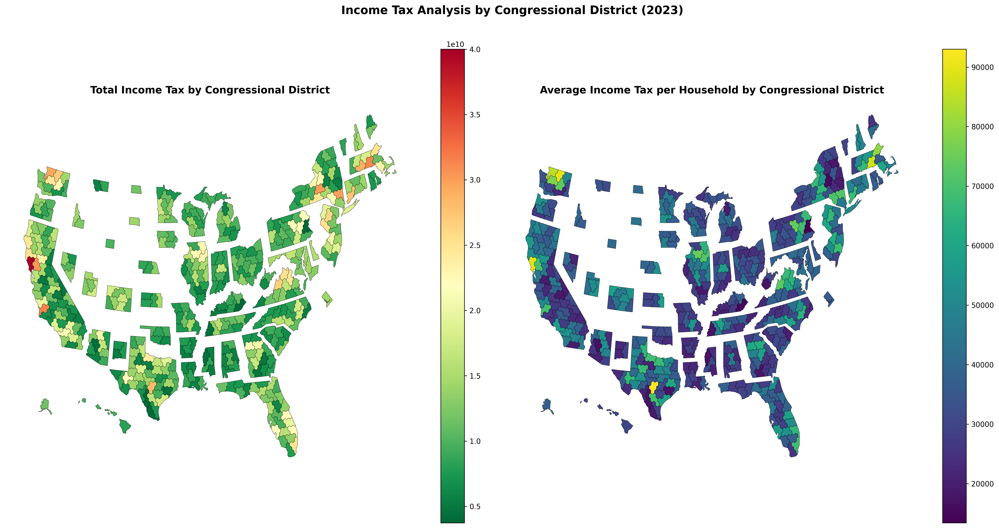

PolicyEngine at the Congressional Hackathon 7.0
=========================================================

District shapefiles are from [The Downballot's maps database](https://docs.google.com/spreadsheets/d/13XkF59JKzvw4SeSq5mbgIFrJfYjK4amg9JoQE5e9grQ/edit?gid=0#gid=0).

The first image produced as a test was .

The second image shows [The Impact of Abolishing the SALT Deduction](salt_impact_by_district.png).

## Technical Notes

### Congressional District GEOID Mapping
When working with congressional district data, there's an important distinction in how single-district (at-large) states are encoded:

- **Shapefile convention**: At-large districts use state FIPS + "00" (e.g., Alaska = 0200) - using 0-based indexing
- **PolicyEngine data convention**: At-large districts use state FIPS + "01" (e.g., Alaska = 0201) - using 1-based indexing

This is essentially a 0-based vs 1-based indexing difference: shapefiles start counting from 0, while PolicyEngine starts from 1. Multi-district states don't show this difference since both conventions use "01" for the first district when there are multiple districts.

This affects the following states with single congressional districts:
- Alaska (02)
- Delaware (10)
- North Dakota (38)
- South Dakota (46)
- Vermont (50)
- Wyoming (56)

The visualization script (`plot_income_stats.py`) includes a mapping correction to ensure these districts display properly with their data.
